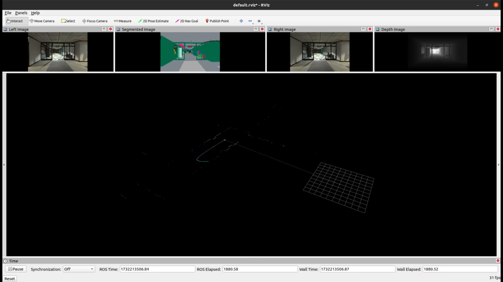
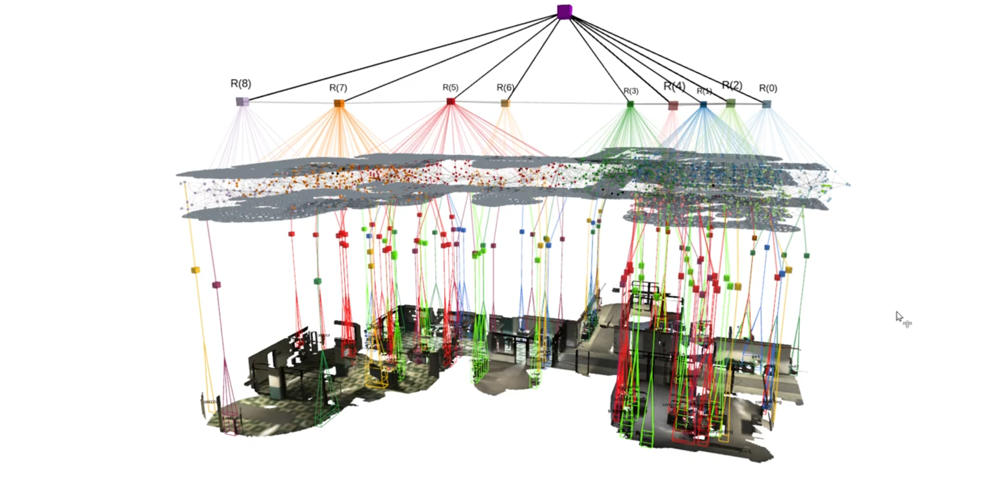

## Hydra-ROS

<div align="center">
    
</div>

This repository contains code to incrementally build 3D Scene Graphs in real-time and is based on the papers:
  - ["Hydra: A Real-time Spatial Perception System for 3D Scene Graph Construction and Optimization"](http://www.roboticsproceedings.org/rss18/p050.pdf)
  - ["Foundations of Spatial Perception for Robotics: Hierarchical Representations and Real-time Systems"](https://journals.sagepub.com/doi/10.1177/02783649241229725)


## Installation 

### General Requirements

Hydra has been tested on Ubuntu 20.04 and ROS Noetic.

Then, make sure you have some general requirements:
```
sudo apt install python3-rosdep python3-catkin-tools python3-vcstool
```

Finally, if you haven't set up rosdep yet:
```
sudo rosdep init
rosdep update
```

### Building Hydra

To get started:

```
mkdir -p hydra_ws/src
cd hydra_ws
catkin init
catkin config -DCMAKE_BUILD_TYPE=Release
cd src
git clone git@github.com:ArghyaChatterjee/Hydra.git hydra
vcs import . < hydra/install/hydra.rosinstall
rosdep install --from-paths . --ignore-src -r -y
cd ..
catkin build
```

## Hydra with default VIO & Segmentation Network

### Downloads
Download a single scene (the office scene without humans is recommended, and can be found [here](https://drive.google.com/uc?id=1CA_1Awu-bewJKpDrILzWok_H_6cOkGDb). The file is around ~16.8 GBs.

<div align="center">
    
</div>

Here are the topics from rosbag:
```
$ rosbag info uHumans2_office_s1_00h.bag 
path:         uHumans2_office_s1_00h.bag
version:      2.0
duration:     8:26s (506s)
start:        Dec 31 1969 18:00:11.40 (11.40)
end:          Dec 31 1969 18:08:37.55 (517.55)
size:         15.7 GB
messages:     742621
compression:  bz2 [33230/33230 chunks; 38.68%]
uncompressed: 40.4 GB @ 81.8 MB/s
compressed:   15.6 GB @ 31.6 MB/s (38.68%)
types:        geometry_msgs/Vector3Stamped [7b324c7325e683bf02a9b14b01090ec7]
              nav_msgs/Odometry            [cd5e73d190d741a2f92e81eda573aca7]
              rosgraph_msgs/Clock          [a9c97c1d230cfc112e270351a944ee47]
              sensor_msgs/CameraInfo       [c9a58c1b0b154e0e6da7578cb991d214]
              sensor_msgs/Image            [060021388200f6f0f447d0fcd9c64743]
              sensor_msgs/Imu              [6a62c6daae103f4ff57a132d6f95cec2]
              sensor_msgs/LaserScan        [90c7ef2dc6895d81024acba2ac42f369]
              tf2_msgs/TFMessage           [94810edda583a504dfda3829e70d7eec]
topics:       /clock                             10151 msgs    : rosgraph_msgs/Clock         
              /tesse/depth_cam/camera_info        8307 msgs    : sensor_msgs/CameraInfo      
              /tesse/depth_cam/mono/image_raw     8307 msgs    : sensor_msgs/Image           
              /tesse/front_lidar/scan            16962 msgs    : sensor_msgs/LaserScan       
              /tesse/imu/clean/imu              101213 msgs    : sensor_msgs/Imu             
              /tesse/imu/noisy/biases/accel     101150 msgs    : geometry_msgs/Vector3Stamped
              /tesse/imu/noisy/biases/gyro      101150 msgs    : geometry_msgs/Vector3Stamped
              /tesse/imu/noisy/imu              101212 msgs    : sensor_msgs/Imu             
              /tesse/left_cam/camera_info         8307 msgs    : sensor_msgs/CameraInfo      
              /tesse/left_cam/mono/image_raw      8307 msgs    : sensor_msgs/Image           
              /tesse/left_cam/rgb/image_raw       8307 msgs    : sensor_msgs/Image           
              /tesse/odom                       101213 msgs    : nav_msgs/Odometry           
              /tesse/rear_lidar/scan             16962 msgs    : sensor_msgs/LaserScan       
              /tesse/right_cam/camera_info        8307 msgs    : sensor_msgs/CameraInfo      
              /tesse/right_cam/mono/image_raw     8307 msgs    : sensor_msgs/Image           
              /tesse/right_cam/rgb/image_raw      8307 msgs    : sensor_msgs/Image           
              /tesse/seg_cam/camera_info          8307 msgs    : sensor_msgs/CameraInfo      
              /tesse/seg_cam/rgb/image_raw        8307 msgs    : sensor_msgs/Image           
              /tf                               109537 msgs    : tf2_msgs/TFMessage          
              /tf_static                             1 msg     : tf2_msgs/TFMessage

```
The rosbag is `bz2` compressed and has a size of `16.8 GB`. After decompression, the rosbag will have a size of `43.4 GB`. So you need to have a total size of `60.2 GB` left in your pc for the whole operation. Decompress the rosbag in the following way:
```
$ rosbag decompress uHumans2_office_s1_00h.bag
```
If you don't decompress the rosbag before playing it, it will require additional CPU cycles to decompress the data while reading it. The decompression can be CPU-intensive, especially with BZ2, which is known for high compression ratios but slower decompression speeds.

<div align="center">
    
</div>

### Launch Hydra
Start Hydra in a terminal:
```
source /opt/ros/noetic/setup.bash
source devel/setup.bash
roslaunch hydra_ros uhumans2.launch
```

Start the decompressed rosbag in a separate terminal:
```
source /opt/ros/noetic/setup.bash
rosbag play ~/uHumans2_office_s1_00h.bag --clock
```
Here are the output nodes:
```
/bag_static_tf_0
/bag_static_tf_1
/bag_static_tf_2
/bag_static_tf_3
/bag_static_tf_4
/bag_static_tf_5
/fake_world_tf
/hydra_dsg_visualizer
/hydra_ros_node
/play_1732218976941353811
/rosout
/rqt_gui_cpp_node_23218
/rqt_gui_cpp_node_24120
/rqt_gui_py_node_23218
/rqt_gui_py_node_24120
/rviz
```
There are 2 nodes that start with the launch of hydra module. They are:
```
/hydra_dsg_visualizer
/hydra_ros_node
```

Hydra `/hydra_ros_node` node subscribed topics:
```
/clock [rosgraph_msgs/Clock]
/tesse/depth_cam/mono/image_raw [sensor_msgs/Image]
/tesse/left_cam/rgb/image_raw [sensor_msgs/Image]
/tesse/seg_cam/rgb/image_raw [sensor_msgs/Image]
/tf [tf2_msgs/TFMessage]
/tf_static [tf2_msgs/TFMessage]
```
Hydra `/hydra_ros_node` node published topics:
```
 * /hydra_ros_node/backend/deformation_graph_mesh_mesh [visualization_msgs/Marker]
 * /hydra_ros_node/backend/deformation_graph_pose_mesh [visualization_msgs/Marker]
 * /hydra_ros_node/backend/dsg [hydra_msgs/DsgUpdate]
 * /hydra_ros_node/backend/pose_graph [pose_graph_tools_msgs/PoseGraph]
 * /hydra_ros_node/frontend/dsg [hydra_msgs/DsgUpdate]
 * /hydra_ros_node/frontend/full_mesh_update [kimera_pgmo_msgs/KimeraPgmoMeshDelta]
 * /hydra_ros_node/frontend/mesh_graph_incremental [pose_graph_tools_msgs/PoseGraph]
 * /hydra_ros_node/gvd/occupancy [nav_msgs/OccupancyGrid]
 * /hydra_ros_node/objects/active_vertices [visualization_msgs/Marker]
 * /hydra_ros_node/objects/object_vertices_semantic_label_10 [visualization_msgs/Marker]
 * /hydra_ros_node/objects/object_vertices_semantic_label_12 [visualization_msgs/Marker]
 * /hydra_ros_node/objects/object_vertices_semantic_label_13 [visualization_msgs/Marker]
 * /hydra_ros_node/objects/object_vertices_semantic_label_18 [visualization_msgs/Marker]
 * /hydra_ros_node/objects/object_vertices_semantic_label_5 [visualization_msgs/Marker]
 * /hydra_ros_node/objects/object_vertices_semantic_label_7 [visualization_msgs/Marker]
 * /hydra_ros_node/places/esdf_viz [visualization_msgs/MarkerArray]
 * /hydra_ros_node/places/freespace_graph_viz [visualization_msgs/MarkerArray]
 * /hydra_ros_node/places/freespace_viz [visualization_msgs/MarkerArray]
 * /hydra_ros_node/places/graph_visualizer/parameter_descriptions [dynamic_reconfigure/ConfigDescription]
 * /hydra_ros_node/places/graph_visualizer/parameter_updates [dynamic_reconfigure/Config]
 * /hydra_ros_node/places/graph_viz [visualization_msgs/MarkerArray]
 * /hydra_ros_node/places/gvd_cluster_viz [visualization_msgs/MarkerArray]
 * /hydra_ros_node/places/gvd_graph_viz [visualization_msgs/MarkerArray]
 * /hydra_ros_node/places/gvd_visualizer/parameter_descriptions [dynamic_reconfigure/ConfigDescription]
 * /hydra_ros_node/places/gvd_visualizer/parameter_updates [dynamic_reconfigure/Config]
 * /hydra_ros_node/places/gvd_viz [visualization_msgs/MarkerArray]
 * /hydra_ros_node/places/surface_viz [visualization_msgs/MarkerArray]
 * /hydra_ros_node/places/visualizer_colormap/parameter_descriptions [dynamic_reconfigure/ConfigDescription]
 * /hydra_ros_node/places/visualizer_colormap/parameter_updates [dynamic_reconfigure/Config]
 * /hydra_ros_node/places/voxel_block_viz [visualization_msgs/MarkerArray]
 * /hydra_ros_node/reconstruction/tsdf_viz [visualization_msgs/MarkerArray]
 * /hydra_ros_node/reconstruction/tsdf_weight_viz [visualization_msgs/MarkerArray]
 * /hydra_ros_node/tsdf/occupancy [nav_msgs/OccupancyGrid]
 * /rosout [rosgraph_msgs/Log]
```
Hydra `/hydra_dsg_visualizer` node subscribed topics:
```
 * /clock [rosgraph_msgs/Clock]
 * /hydra_ros_node/backend/dsg [hydra_msgs/DsgUpdate]

```
Hydra `/hydra_dsg_visualizer` node published topics:
```
 * /hydra_dsg_visualizer/config/dynamic_layer/2/parameter_descriptions [dynamic_reconfigure/ConfigDescription]
 * /hydra_dsg_visualizer/config/dynamic_layer/2/parameter_updates [dynamic_reconfigure/Config]
 * /hydra_dsg_visualizer/config/layer2/parameter_descriptions [dynamic_reconfigure/ConfigDescription]
 * /hydra_dsg_visualizer/config/layer2/parameter_updates [dynamic_reconfigure/Config]
 * /hydra_dsg_visualizer/config/layer20/parameter_descriptions [dynamic_reconfigure/ConfigDescription]
 * /hydra_dsg_visualizer/config/layer20/parameter_updates [dynamic_reconfigure/Config]
 * /hydra_dsg_visualizer/config/layer3/parameter_descriptions [dynamic_reconfigure/ConfigDescription]
 * /hydra_dsg_visualizer/config/layer3/parameter_updates [dynamic_reconfigure/Config]
 * /hydra_dsg_visualizer/config/layer4/parameter_descriptions [dynamic_reconfigure/ConfigDescription]
 * /hydra_dsg_visualizer/config/layer4/parameter_updates [dynamic_reconfigure/Config]
 * /hydra_dsg_visualizer/config/layer5/parameter_descriptions [dynamic_reconfigure/ConfigDescription]
 * /hydra_dsg_visualizer/config/layer5/parameter_updates [dynamic_reconfigure/Config]
 * /hydra_dsg_visualizer/config/parameter_descriptions [dynamic_reconfigure/ConfigDescription]
 * /hydra_dsg_visualizer/config/parameter_updates [dynamic_reconfigure/Config]
 * /hydra_dsg_visualizer/dsg_markers [visualization_msgs/MarkerArray]
 * /hydra_dsg_visualizer/dsg_mesh [kimera_pgmo_msgs/KimeraPgmoMesh]
 * /hydra_dsg_visualizer/dynamic_layers_viz [visualization_msgs/MarkerArray]
 * /hydra_dsg_visualizer/gt_regions [visualization_msgs/MarkerArray]
 * /rosout [rosgraph_msgs/Log]
```
Topics publishing rate from rosbag:
```
/tf_static                      : Once
/tf                             : 228 Hz
/clock                          : 21 Hz
/tesse/depth_cam/mono/image_raw : 17 Hz
/tesse/left_cam/rgb/image_raw   : 17 Hz
/tesse/seg_cam/rgb/image_raw    : 17 Hz
```
Tf tree from rosbag:
```
map
 └── world
      └── base_link_gt
           ├── front_lidar
           ├── left_cam
           ├── rear_lidar
           └── right_cam
```

### Output Dynamic Scene Graph

<div align="center">
    
</div>

Here is the output topic list:
```
/clock
/hydra_dsg_visualizer/config/dynamic_layer/2/parameter_descriptions
/hydra_dsg_visualizer/config/dynamic_layer/2/parameter_updates
/hydra_dsg_visualizer/config/layer2/parameter_descriptions
/hydra_dsg_visualizer/config/layer2/parameter_updates
/hydra_dsg_visualizer/config/layer20/parameter_descriptions
/hydra_dsg_visualizer/config/layer20/parameter_updates
/hydra_dsg_visualizer/config/layer3/parameter_descriptions
/hydra_dsg_visualizer/config/layer3/parameter_updates
/hydra_dsg_visualizer/config/layer4/parameter_descriptions
/hydra_dsg_visualizer/config/layer4/parameter_updates
/hydra_dsg_visualizer/config/layer5/parameter_descriptions
/hydra_dsg_visualizer/config/layer5/parameter_updates
/hydra_dsg_visualizer/config/parameter_descriptions
/hydra_dsg_visualizer/config/parameter_updates
/hydra_dsg_visualizer/dsg_markers
/hydra_dsg_visualizer/dsg_mesh
/hydra_dsg_visualizer/dynamic_layers_viz
/hydra_dsg_visualizer/gt_regions
/hydra_ros_node/backend/deformation_graph_mesh_mesh
/hydra_ros_node/backend/deformation_graph_pose_mesh
/hydra_ros_node/backend/dsg
/hydra_ros_node/backend/pose_graph
/hydra_ros_node/frontend/dsg
/hydra_ros_node/frontend/full_mesh_update
/hydra_ros_node/frontend/mesh_graph_incremental
/hydra_ros_node/gvd/occupancy
/hydra_ros_node/objects/active_vertices
/hydra_ros_node/objects/object_vertices_semantic_label_10
/hydra_ros_node/objects/object_vertices_semantic_label_12
/hydra_ros_node/objects/object_vertices_semantic_label_13
/hydra_ros_node/objects/object_vertices_semantic_label_18
/hydra_ros_node/objects/object_vertices_semantic_label_5
/hydra_ros_node/objects/object_vertices_semantic_label_7
/hydra_ros_node/places/esdf_viz
/hydra_ros_node/places/freespace_graph_viz
/hydra_ros_node/places/freespace_viz
/hydra_ros_node/places/graph_visualizer/parameter_descriptions
/hydra_ros_node/places/graph_visualizer/parameter_updates
/hydra_ros_node/places/graph_viz
/hydra_ros_node/places/gvd_cluster_viz
/hydra_ros_node/places/gvd_graph_viz
/hydra_ros_node/places/gvd_visualizer/parameter_descriptions
/hydra_ros_node/places/gvd_visualizer/parameter_updates
/hydra_ros_node/places/gvd_viz
/hydra_ros_node/places/surface_viz
/hydra_ros_node/places/visualizer_colormap/parameter_descriptions
/hydra_ros_node/places/visualizer_colormap/parameter_updates
/hydra_ros_node/places/voxel_block_viz
/hydra_ros_node/reconstruction/tsdf_viz
/hydra_ros_node/reconstruction/tsdf_weight_viz
/hydra_ros_node/tsdf/occupancy
/incremental_dsg_builder_node/pgmo/deformation_graph_mesh_mesh
/incremental_dsg_builder_node/pgmo/deformation_graph_mesh_mesh_array
/incremental_dsg_builder_node/pgmo/deformation_graph_pose_mesh
/incremental_dsg_builder_node/pgmo/deformation_graph_pose_mesh_array
/tesse/depth_cam/camera_info
/tesse/depth_cam/mono/image_raw
/tesse/front_lidar/scan
/tesse/imu/clean/imu
/tesse/imu/noisy/biases/accel
/tesse/imu/noisy/biases/gyro
/tesse/imu/noisy/imu
/tesse/left_cam/camera_info
/tesse/left_cam/mono/image_raw
/tesse/left_cam/rgb/image_raw
/tesse/odom
/tesse/rear_lidar/scan
/tesse/right_cam/camera_info
/tesse/right_cam/mono/image_raw
/tesse/right_cam/rgb/image_raw
/tesse/seg_cam/camera_info
/tesse/seg_cam/rgb/image_raw
/tf
/tf_static
```

## Hydra with Kimera VIO & default Segmentation Network
You can configure your workspace to also include Kimera-VIO by:
```
~/hydra_ws/src
vcs import . < hydra/install/vio_overlay.rosinstall
cd ..
catkin init
catkin config -a --cmake-args -DGTSAM_USE_SYSTEM_EIGEN=ON -DCMAKE_BUILD_TYPE=RelWithDebInfo -DGTSAM_TANGENT_PREINTEGRATION=OFF -DGTSAM_BUILD_WITH_MARCH_NATIVE=OFF -DOPENGV_BUILD_WITH_MARCH_NATIVE=OFF
cd src
catkin build
```

### Using Kimera VIO Only

First, start Kimera:

```
source /opt/ros/noetic/setup.bash
cd ~/hydra_ws
source devel/setup.bash
roslaunch kimera_vio_ros kimera_vio_ros_uhumans2.launch online:=true viz_type:=1 use_lcd:=false
```
Kimera VIO starts to publish the odometry in `/kimera_vio_ros/odometry` topic and the frame transforms are published in `world` to `base_link_kimera` frame.

In a separate terminal, run hydra:

```
source /opt/ros/noetic/setup.bash
cd ~/hydra_ws
source devel/setup.bash
roslaunch hydra_ros uhumans2.launch use_gt_frame:=false
```
When you set `use_gt_frame:=false`:
```
- The robot frame is switched to `base_link_kimera`.
- The odometry frame remains `world`.
- The sensor frame becomes `left_cam_kimera`.
- The `fake_world_tf` static transform publisher pubslishes transform as it is from `map` to `world` frame.
- Semantic configurations and includes remain the same depending on `use_gt_semantics` and other arguments.
```
Now, start the decompressed rosbag in a separate terminal:
```
source /opt/ros/noetic/setup.bash
rosbag play ~/uHumans2_office_s1_00h.bag --clock
```
Tf tree from rosbag and kimera vio:
```
map
 └── world
      ├── base_link_gt
      │    ├── front_lidar
      │    ├── left_cam
      │    ├── rear_lidar
      │    └── right_cam
      └── base_link_kimera
           ├── left_cam_kimera
           └── right_cam_kimera

```
List of ros topics:
```
$ rostopic list
/clicked_point
/clock
/hydra_dsg_visualizer/dsg_markers
/hydra_dsg_visualizer/dsg_mesh
/hydra_dsg_visualizer/dynamic_layers_viz
/hydra_dsg_visualizer/gt_regions
/hydra_ros_node/backend/deformation_graph_mesh_mesh
/hydra_ros_node/backend/deformation_graph_pose_mesh
/hydra_ros_node/backend/dsg
/hydra_ros_node/backend/pose_graph
/hydra_ros_node/frontend/dsg
/hydra_ros_node/frontend/full_mesh_update
/hydra_ros_node/frontend/mesh_graph_incremental
/hydra_ros_node/gvd/occupancy
/hydra_ros_node/objects/active_vertices
/hydra_ros_node/places/graph_visualizer/parameter_descriptions
/hydra_ros_node/places/graph_visualizer/parameter_updates
/hydra_ros_node/places/gvd_visualizer/parameter_descriptions
/hydra_ros_node/places/gvd_visualizer/parameter_updates
/hydra_ros_node/places/visualizer_colormap/parameter_descriptions
/hydra_ros_node/places/visualizer_colormap/parameter_updates
/hydra_ros_node/tsdf/occupancy
/initialpose
/kimera_distributed/optimized_nodes
/kimera_vio_ros/bow_query
/kimera_vio_ros/frontend_stats
/kimera_vio_ros/imu_bias
/kimera_vio_ros/interactive_node/feedback
/kimera_vio_ros/interactive_node/update
/kimera_vio_ros/interactive_node/update_full
/kimera_vio_ros/kimera_vio_ros_node/feature_tracks
/kimera_vio_ros/kimera_vio_ros_node/feature_tracks/compressed
/kimera_vio_ros/kimera_vio_ros_node/feature_tracks/compressed/parameter_descriptions
/kimera_vio_ros/kimera_vio_ros_node/feature_tracks/compressed/parameter_updates
/kimera_vio_ros/kimera_vio_ros_node/feature_tracks/compressedDepth
/kimera_vio_ros/kimera_vio_ros_node/feature_tracks/compressedDepth/parameter_descriptions
/kimera_vio_ros/kimera_vio_ros_node/feature_tracks/compressedDepth/parameter_updates
/kimera_vio_ros/kimera_vio_ros_node/feature_tracks/theora
/kimera_vio_ros/kimera_vio_ros_node/feature_tracks/theora/parameter_descriptions
/kimera_vio_ros/kimera_vio_ros_node/feature_tracks/theora/parameter_updates
/kimera_vio_ros/mesh
/kimera_vio_ros/odometry
/kimera_vio_ros/optimized_odometry
/kimera_vio_ros/optimized_trajectory
/kimera_vio_ros/pose_graph
/kimera_vio_ros/pose_graph_incremental
/kimera_vio_ros/posegraph_viewer/graph_nodes
/kimera_vio_ros/posegraph_viewer/graph_nodes_ids
/kimera_vio_ros/posegraph_viewer/loop_edges
/kimera_vio_ros/posegraph_viewer/odometry_edges
/kimera_vio_ros/posegraph_viewer/rejected_loop_edges
/kimera_vio_ros/reinit_flag
/kimera_vio_ros/reinit_pose
/kimera_vio_ros/resiliency
/kimera_vio_ros/time_horizon_pointcloud
/kimera_vio_ros/vlc_frames
/move_base_simple/goal
/rosout
/rosout_agg
/tesse/depth_cam/camera_info
/tesse/depth_cam/mono/image_raw
/tesse/depth_cam/mono/image_raw/mouse_click
/tesse/front_lidar/scan
/tesse/imu/clean/imu
/tesse/imu/noisy/biases/accel
/tesse/imu/noisy/biases/gyro
/tesse/imu/noisy/imu
/tesse/left_cam/camera_info
/tesse/left_cam/mono/image_raw
/tesse/left_cam/rgb/image_raw
/tesse/left_cam/rgb/image_raw/mouse_click
/tesse/odom
/tesse/rear_lidar/scan
/tesse/right_cam/camera_info
/tesse/right_cam/mono/image_raw
/tesse/right_cam/rgb/image_raw
/tesse/seg_cam/camera_info
/tesse/seg_cam/rgb/image_raw
/tesse/seg_cam/rgb/image_raw/mouse_click
/tf
/tf_static
```

There are 2 nodes that start with the launch of Kimera VIO module. They are:
```
/kimera_vio_ros/kimera_vio_ros_node
/kimera_vio_ros/posegraph_viewer
```
Kimera `/kimera_vio_ros/posegraph_viewer` node subscribed topics:
```
 * /clock [rosgraph_msgs/Clock]
 * /kimera_vio_ros/interactive_node/feedback [unknown type]
 * /kimera_vio_ros/pose_graph [pose_graph_tools_msgs/PoseGraph]
```
Kimera `/kimera_vio_ros/posegraph_viewer` node published topics:
```
 * /kimera_vio_ros/interactive_node/update [visualization_msgs/InteractiveMarkerUpdate]
 * /kimera_vio_ros/interactive_node/update_full [visualization_msgs/InteractiveMarkerInit]
 * /kimera_vio_ros/posegraph_viewer/graph_nodes [visualization_msgs/Marker]
 * /kimera_vio_ros/posegraph_viewer/graph_nodes_ids [visualization_msgs/Marker]
 * /kimera_vio_ros/posegraph_viewer/loop_edges [visualization_msgs/Marker]
 * /kimera_vio_ros/posegraph_viewer/odometry_edges [visualization_msgs/Marker]
 * /kimera_vio_ros/posegraph_viewer/rejected_loop_edges [visualization_msgs/Marker]
 * /rosout [rosgraph_msgs/Log]
```
Kimera `/kimera_vio_ros/kimera_vio_ros_node` node subscribed topics:
```
 * /clock [rosgraph_msgs/Clock]
 * /kimera_vio_ros/reinit_flag [unknown type]
 * /kimera_vio_ros/reinit_pose [unknown type]
 * /tesse/imu/clean/imu [sensor_msgs/Imu]
 * /tesse/left_cam/mono/image_raw [sensor_msgs/Image]
 * /tesse/odom [nav_msgs/Odometry]
 * /tesse/right_cam/mono/image_raw [sensor_msgs/Image]
```
Kimera `/kimera_vio_ros/kimera_vio_ros_node` node published topics:
```
 * /kimera_vio_ros/bow_query [pose_graph_tools_msgs/BowQueries]
 * /kimera_vio_ros/frontend_stats [std_msgs/Float64MultiArray]
 * /kimera_vio_ros/imu_bias [std_msgs/Float64MultiArray]
 * /kimera_vio_ros/kimera_vio_ros_node/feature_tracks [sensor_msgs/Image]
 * /kimera_vio_ros/kimera_vio_ros_node/feature_tracks/compressed [sensor_msgs/CompressedImage]
 * /kimera_vio_ros/kimera_vio_ros_node/feature_tracks/compressed/parameter_descriptions [dynamic_reconfigure/ConfigDescription]
 * /kimera_vio_ros/kimera_vio_ros_node/feature_tracks/compressed/parameter_updates [dynamic_reconfigure/Config]
 * /kimera_vio_ros/kimera_vio_ros_node/feature_tracks/compressedDepth [sensor_msgs/CompressedImage]
 * /kimera_vio_ros/kimera_vio_ros_node/feature_tracks/compressedDepth/parameter_descriptions [dynamic_reconfigure/ConfigDescription]
 * /kimera_vio_ros/kimera_vio_ros_node/feature_tracks/compressedDepth/parameter_updates [dynamic_reconfigure/Config]
 * /kimera_vio_ros/kimera_vio_ros_node/feature_tracks/theora [theora_image_transport/Packet]
 * /kimera_vio_ros/kimera_vio_ros_node/feature_tracks/theora/parameter_descriptions [dynamic_reconfigure/ConfigDescription]
 * /kimera_vio_ros/kimera_vio_ros_node/feature_tracks/theora/parameter_updates [dynamic_reconfigure/Config]
 * /kimera_vio_ros/mesh [pcl_msgs/PolygonMesh]
 * /kimera_vio_ros/odometry [nav_msgs/Odometry]
 * /kimera_vio_ros/optimized_odometry [nav_msgs/Odometry]
 * /kimera_vio_ros/optimized_trajectory [nav_msgs/Path]
 * /kimera_vio_ros/pose_graph [pose_graph_tools_msgs/PoseGraph]
 * /kimera_vio_ros/pose_graph_incremental [pose_graph_tools_msgs/PoseGraph]
 * /kimera_vio_ros/resiliency [std_msgs/Float64MultiArray]
 * /kimera_vio_ros/time_horizon_pointcloud [sensor_msgs/PointCloud2]
 * /kimera_vio_ros/vlc_frames [pose_graph_tools_msgs/VLCFrames]
 * /rosout [rosgraph_msgs/Log]
 * /tf [tf2_msgs/TFMessage]
 * /tf_static [tf2_msgs/TFMessage]

```
Echo `/tf` topic:
```
$ rostopic echo /tf
transforms: 
  - 
    header: 
      seq: 0
      stamp: 
        secs: 431
        nsecs: 254900000
      frame_id: "world"
    child_frame_id: "base_link_kimera"
    transform: 
      translation: 
        x: 19.604710856789612
        y: 25.92507683583814
        z: 2.748140179070399
      rotation: 
        x: 0.009504226737755991
        y: 0.006379345902372752
        z: 0.789339974395349
        w: 0.6138496383023587
---
transforms: 
  - 
    header: 
      seq: 0
      stamp: 
        secs: 431
        nsecs: 310000000
      frame_id: "world"
    child_frame_id: "base_link_gt"
    transform: 
      translation: 
        x: 19.51595
        y: 25.56333
        z: 2.496982
      rotation: 
        x: 0.00836634196535517
        y: 0.006589348641827742
        z: 0.7855672971653143
        w: 0.6186845774956556
---
```
Echo `/kimera_vio_ros/odometry` topic:
```
$ rostopic echo /kimera_vio_ros/odometry
header: 
  seq: 2
  stamp: 
    secs: 120
    nsecs: 754900000
  frame_id: "world"
child_frame_id: "base_link_kimera"
pose: 
  pose: 
    position: 
      x: 1.1551319306117498
      y: 18.06044637912025
      z: 2.5716418522385394
    orientation: 
      x: -0.0069460783801739414
      y: 0.007613975510373809
      z: -0.7109593274023065
      w: 0.7031576026409547
  covariance: [0.0, 0.0, 0.0, 0.0, 0.0, 0.0, 0.0, 0.0, 0.0, 0.0, 0.0, 0.0, 0.0, 0.0, 0.0, 0.0, 0.0, 0.0, 0.0, 0.0, 0.0, 0.0, 0.0, 0.0, 0.0, 0.0, 0.0, 0.0, 0.0, 0.0, 0.0, 0.0, 0.0, 0.0, 0.0, 0.0]
twist: 
  twist: 
    linear: 
      x: 0.7145587062645125
      y: 0.03567164206040431
      z: 0.0041914637215003546
    angular: 
      x: 0.0
      y: 0.0
      z: 0.0
  covariance: [0.0, 0.0, 0.0, 0.0, 0.0, 0.0, -0.0, 0.0, 0.0, 0.0, 0.0, 0.0, -0.0, 0.0, 0.0, 0.0, 0.0, 0.0, 0.0, 0.0, 0.0, 0.0, 0.0, 0.0, 0.0, 0.0, 0.0, 0.0, 0.0, 0.0, 0.0, 0.0, 0.0, 0.0, 0.0, 0.0]
---
```
Echo kimera `/kimera_vio_ros/odometry` topic publishing rate:
```
$ rostopic hz /kimera_vio_ros/odometry
average rate: 4.075
	min: 0.202s max: 0.283s std dev: 0.02989s window: 5
```

### Using Kimera VIO and External Visual Loop Closures

First, start Kimera:

```
roslaunch kimera_vio_ros kimera_vio_ros_uhumans2.launch online:=true viz_type:=1 \
    use_lcd:=true \
    lcd_no_optimize:=true
```

and in a separate terminal, run the same command for Hydra:

```
roslaunch hydra_ros uhumans2.launch use_gt_frame:=false
```

To achieve the best results with Kimera-VIO, you should wait for the LCD vocabulary to finish loading before starting the rosbag.

### Using Kimera VIO and Dynamic Scene Graph Loop Closures

First, start Kimera:

```
roslaunch kimera_vio_ros kimera_vio_ros_uhumans2.launch online:=true viz_type:=1 \
     use_lcd:=true \
     lcd_no_detection:=true
```

and in a separate terminal, run the same command for Hydra:

```
roslaunch hydra_ros uhumans2.launch use_gt_frame:=false enable_dsg_lcd:=true
```

To achieve the best results with Kimera-VIO, you should wait for the LCD vocabulary to finish loading before starting the rosbag.

## Hydra with default VIO and Custom Semantic Segmentation Network

Add `semantic_recolor` to your workspace via:

```
~/hydra_ws/src/ 
vcs import . < hydra/install/semantic_overlay.rosinstall
```

Then, follow the instructions to install cuda and other dependencies for the `semantic_recolor` package (which can be found [here](https://github.mit.edu/SPARK/semantic_recolor_nodelet#semantic-recolor-utilities)).

Finally, build your workspace:

```
catkin build
```
## Hydra with Kimera VIO and Custom Semantic Segmentation Network

First, start Kimera:
```
roslaunch kimera_vio_ros kimera_vio_ros_uhumans2.launch online:=true viz_type:=1 use_lcd:=false
```
2nd, start the segmentation network:
```
roslaunch semantic_inference_ros semantic_inference.launch
```
The image topic it's expecting/subscribing is `semantic_inference/color/image_raw` and publishing is `/semantic_inference/semantic_color/image_raw`. You can also remap the topic as:
```
rosbag play ~/uHumans2_office_s1_00h.bag --clock /tesse/left_cam/rgb/image_raw:=/semantic_inference/color/image_raw
```
In a separate terminal, start hydra:
```
roslaunch hydra_ros uhumans2.launch use_gt_frame:=false 
```
If you don't want to launch the `semantic_inference.launch` file in a separate terminal, do the following when launchign the `uhumans2.launch` file:
```
roslaunch hydra_ros uhumans2.launch use_gt_frame:=false use_gt_semantics:=false
```
And finally, run the rosbag:
```
rosbag play ~/uHumans2_office_s1_00h.bag --clock
```
The following changes will happen when `use_gt_semantics` is set to `false`.

- Label Space and Semantic Map Directory: Label space changes to `ade20k_mp3d` and Semantic map directory changes to `$(find semantic_inference)/config/colors`.

- Semantic Label Topic: The label topic switches to `/semantic_inference/semantic_color/image_raw` from simulator-provided topics like `/tesse/seg_cam/rgb/image_raw`.

- Semantic Inference Node: The semantic inference node is launched (`semantic_inference_ros/semantic_inference.launch`).

- Simulator-Provided Semantics: Simulator-provided semantics are disabled.

The published topics are published real-time at:
```
$ rostopic hz /semantic_inference/semantic/image_raw
average rate: 16.840
	min: 0.032s max: 0.115s std dev: 0.02384s window: 17
$ rostopic hz /semantic_inference/semantic_overlay/image_raw
average rate: 17.852
	min: 0.038s max: 0.117s std dev: 0.02114s window: 18
$ rostopic hz /semantic_inference/semantic_color/image_raw
average rate: 18.962
	min: 0.034s max: 0.109s std dev: 0.01480s window: 19
```
The subscribed topic is published at:
```
$ rostopic hz /tesse/left_cam/camera_info
average rate: 19.017
	min: 0.041s max: 0.105s std dev: 0.01366s window: 17
```
So, they are pretty much real-time. 

# Note:
Here are some of the details about the topics that are being published from the uhumans rosbag.

- Echo `/tesse/left_cam/rgb/image_raw` topic:
```
$ rostopic echo -n1 /tesse/left_cam/rgb/image_raw
header: 
  seq: 865
  stamp: 
    secs: 59
    nsecs: 404879999
  frame_id: "left_cam"
height: 480
width: 720
encoding: "rgb8"
is_bigendian: 0
step: 2160
data: [56, 53, 45, 52, ...]
```

- Echo `/tesse/left_cam/mono/image_raw` topic:
```
$ rostopic echo -n1 /tesse/left_cam/mono/image_raw
header: 
  seq: 1584
  stamp: 
    secs: 101
    nsecs: 704899999
  frame_id: "left_cam"
height: 480
width: 720
encoding: "mono8"
is_bigendian: 0
step: 720
data: [51, 52, 51, 51, ...]
```

- Echo `/tesse/depth_cam/mono/image_raw` topic:
```
$ rostopic echo -n1 /tesse/depth_cam/mono/image_raw
header: 
  seq: 3046
  stamp: 
    secs: 197
    nsecs: 854899999
  frame_id: "left_cam"
height: 480
width: 720
encoding: "32FC1"
is_bigendian: 0
step: 2880
data: [34, 18, 30, 64, 7, ...]
```

- Echo `/tesse/odom` topic: 
```
$ rostopic echo -n1 /tesse/odom
header: 
  seq: 70201
  stamp: 
    secs: 362
    nsecs: 490000000
  frame_id: "world"
child_frame_id: "base_link_gt"
pose: 
  pose: 
    position: 
      x: 21.96915
      y: 40.73519
      z: 2.500258
    orientation: 
      x: 0.006866087457755151
      y: 0.00814112167970659
      z: 0.6446937069625222
      w: 0.7643667988497015
  covariance: [0.0, 0.0, 0.0, 0.0, 0.0, 0.0, 0.0, 0.0, 0.0, 0.0, 0.0, 0.0, 0.0, 0.0, 0.0, 0.0, 0.0, 0.0, 0.0, 0.0, 0.0, 0.0, 0.0, 0.0, 0.0, 0.0, 0.0, 0.0, 0.0, 0.0, 0.0, 0.0, 0.0, 0.0, 0.0, 0.0]
twist: 
  twist: 
    linear: 
      x: 0.6005164
      y: 0.1821608
      z: -0.002654613
    angular: 
      x: 8.217624567488738e-07
      y: 6.983974123567022e-08
      z: -0.23253671815683402
  covariance: [0.0, 0.0, 0.0, 0.0, 0.0, 0.0, 0.0, 0.0, 0.0, 0.0, 0.0, 0.0, 0.0, 0.0, 0.0, 0.0, 0.0, 0.0, 0.0, 0.0, 0.0, 0.0, 0.0, 0.0, 0.0, 0.0, 0.0, 0.0, 0.0, 0.0, 0.0, 0.0, 0.0, 0.0, 0.0, 0.0]
```

- Echo rosbag `/tesse/odom` topic publishing rate:
```
$ rostopic hz /tesse/odom
average rate: 198.805
	min: 0.000s max: 0.015s std dev: 0.00487s window: 200
```

- Echo `/tesse/seg_cam/rgb/image_raw` topic:
```
$ rostopic echo -n1 /tesse/seg_cam/rgb/image_raw
header: 
  seq: 128
  stamp: 
    secs: 17
    nsecs: 954879999
  frame_id: "left_cam"
height: 480
width: 720
encoding: "rgb8"
is_bigendian: 0
step: 2160
data: [125, 218, 3, 125, 218, ...]
```

- Echo `/tesse/imu/clean/imu` topic:
```
$ rostopic echo -n1 /tesse/imu/clean/imu
header: 
  seq: 36962
  stamp: 
    secs: 196
    nsecs: 294999999
  frame_id: "base_link_gt"
orientation: 
  x: 0.0
  y: 0.0
  z: 0.0
  w: 0.0
orientation_covariance: [0.0, 0.0, 0.0, 0.0, 0.0, 0.0, 0.0, 0.0, 0.0]
angular_velocity: 
  x: 1.8282136960404371e-07
  y: 2.4693349096180957e-07
  z: -0.2116600191629781
angular_velocity_covariance: [0.0, 0.0, 0.0, 0.0, 0.0, 0.0, 0.0, 0.0, 0.0]
linear_acceleration: 
  x: 0.24822837598984826
  y: 0.2962241692971665
  z: 9.807736364640686
linear_acceleration_covariance: [0.0, 0.0, 0.0, 0.0, 0.0, 0.0, 0.0, 0.0, 0.0]
```

- Echo `/tf_static` topic:
```
$ rostopic echo /tf_static
transforms: 
  - 
    header: 
      seq: 0
      stamp: 
        secs: 0
        nsecs:         0
      frame_id: "base_link_gt"
    child_frame_id: "right_cam"
    transform: 
      translation: 
        x: 0.0
        y: -0.05
        z: 0.0
      rotation: 
        x: 0.5
        y: -0.5
        z: 0.5
        w: -0.5
---
transforms: 
  - 
    header: 
      seq: 0
      stamp: 
        secs: 0
        nsecs:         0
      frame_id: "base_link_gt"
    child_frame_id: "left_cam"
    transform: 
      translation: 
        x: 0.0
        y: 0.05
        z: 0.0
      rotation: 
        x: 0.5
        y: -0.5
        z: 0.5
        w: -0.5
---
transforms: 
  - 
    header: 
      seq: 0
      stamp: 
        secs: 0
        nsecs:         0
      frame_id: "base_link_gt"
    child_frame_id: "rear_lidar"
    transform: 
      translation: 
        x: -0.17
        y: -0.017
        z: 0.0
      rotation: 
        x: 0.0
        y: 0.0
        z: 0.0
        w: 1.0
---
transforms: 
  - 
    header: 
      seq: 0
      stamp: 
        secs: 0
        nsecs:         0
      frame_id: "map"
    child_frame_id: "world"
    transform: 
      translation: 
        x: 0.0
        y: 0.0
        z: 0.0
      rotation: 
        x: 0.0
        y: 0.0
        z: 0.0
        w: 1.0
---
transforms: 
  - 
    header: 
      seq: 0
      stamp: 
        secs: 0
        nsecs:         0
      frame_id: "base_link_gt"
    child_frame_id: "front_lidar"
    transform: 
      translation: 
        x: 0.17
        y: -0.017
        z: 0.0
      rotation: 
        x: 0.0
        y: 0.0
        z: 0.0
        w: 1.0
```

- Echo `/tf` topic:
```
$ rostopic echo /tf
transforms: 
  - 
    header: 
      seq: 0
      stamp: 
        secs: 432
        nsecs: 154899999
      frame_id: "world"
    child_frame_id: "base_link_gt"
    transform: 
      translation: 
        x: 19.73053
        y: 25.51378
        z: 2.497293
      rotation: 
        x: 0.008492810313284773
        y: 0.006425529979661489
        z: 0.7974413381818911
        w: 0.6033024920354114
```

- Echo `/tesse/left_cam/camera_info` topic:
```
$ rostopic echo -n1 /tesse/left_cam/camera_info
header: 
  seq: 1232
  stamp: 
    secs: 80
    nsecs: 404880000
  frame_id: "left_cam"
height: 480
width: 720
distortion_model: "radial-tangential"
D: [0.0, 0.0, 0.0, 0.0]
K: [415.69219381653056, 0.0, 360.0, 0.0, 415.69219381653056, 240.0, 0.0, 0.0, 1.0]
R: [1.0, 0.0, 0.0, 0.0, 1.0, 0.0, 0.0, 0.0, 1.0]
P: [415.69219381653056, 0.0, 360.0, 0.0, 0.0, 415.69219381653056, 240.0, 0.0, 0.0, 0.0, 1.0, 0.0]
binning_x: 0
binning_y: 0
roi: 
  x_offset: 0
  y_offset: 0
  height: 0
  width: 0
  do_rectify: False
```

- Echo `/tesse/right_cam/camera_info` topic:
```
$ rostopic echo -n1 /tesse/right_cam/camera_info
header: 
  seq: 1986
  stamp: 
    secs: 128
    nsecs: 704900000
  frame_id: "right_cam"
height: 480
width: 720
distortion_model: "radial-tangential"
D: [0.0, 0.0, 0.0, 0.0]
K: [415.69219381653056, 0.0, 360.0, 0.0, 415.69219381653056, 240.0, 0.0, 0.0, 1.0]
R: [1.0, 0.0, 0.0, 0.0, 1.0, 0.0, 0.0, 0.0, 1.0]
P: [415.69219381653056, 0.0, 360.0, 0.0, 0.0, 415.69219381653056, 240.0, 0.0, 0.0, 0.0, 1.0, 0.0]
binning_x: 0
binning_y: 0
roi: 
  x_offset: 0
  y_offset: 0
  height: 0
  width: 0
  do_rectify: False
```

- Echo `/tesse/depth_cam/camera_info` topic:
```
$ rostopic echo -n1 /tesse/depth_cam/camera_info
header: 
  seq: 2517
  stamp: 
    secs: 162
    nsecs: 804900000
  frame_id: "left_cam"
height: 480
width: 720
distortion_model: "radial-tangential"
D: [0.0, 0.0, 0.0, 0.0]
K: [415.69219381653056, 0.0, 360.0, 0.0, 415.69219381653056, 240.0, 0.0, 0.0, 1.0]
R: [1.0, 0.0, 0.0, 0.0, 1.0, 0.0, 0.0, 0.0, 1.0]
P: [415.69219381653056, 0.0, 360.0, 0.0, 0.0, 415.69219381653056, 240.0, 0.0, 0.0, 0.0, 1.0, 0.0]
binning_x: 0
binning_y: 0
roi: 
  x_offset: 0
  y_offset: 0
  height: 0
  width: 0
  do_rectify: False
```